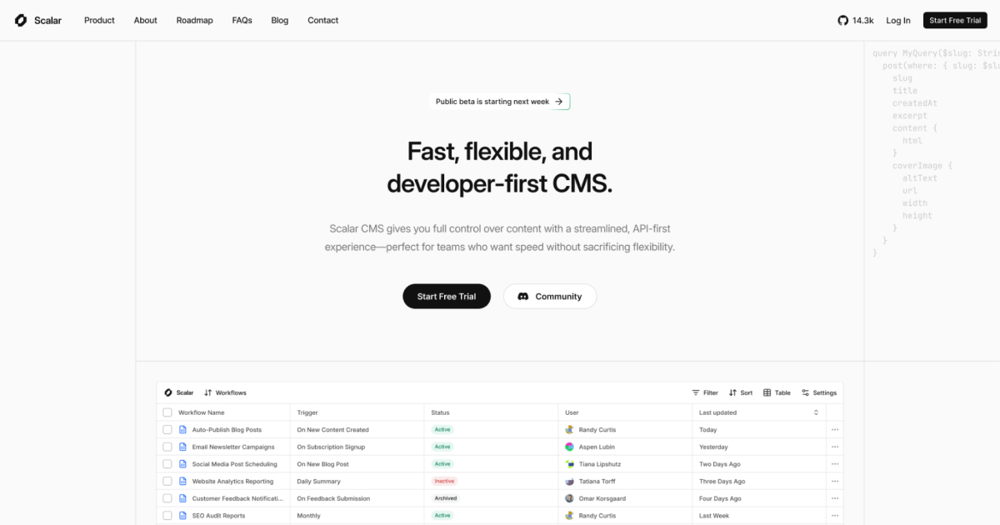

# Scalar NextJS Template

Scalar NextJS Template is a premium template built by https://www.shadcnblocks.com

- [Demo](https://scalar-nextjs-template.vercel.app/)
- [Documentation](https://docs.shadcnblocks.com/templates/getting-started)

## Screenshot



## Getting Started

```bash
npm install
```

```bash
npm run dev
```

Open [http://localhost:3000](http://localhost:3000) with your browser to see the result.

## Tech Stack

- Nextjs 15 / App Router
- Tailwind 4
- shadcn/ui

## Deploy on Vercel

The easiest way to deploy your Next.js app is to use the [Vercel Platform](https://vercel.com)

## Search Configuration Fumadocs

### Default (Static Export Compatible)

By default, this template uses **static search** which is compatible with static export. The search uses `staticGET` to generate search indexes at build time that are downloaded by the client when needed.

**How it works:**

- Build time: Search indexes are generated using `staticGET`
- Runtime: Client downloads indexes and uses Orama for client-side search
- Both custom search and native Fumadocs search work with static data
- Compatible with static export (`output: 'export'`)

**Configuration:**

The `RootProvider` in `src/app/layout.tsx` is configured to use static search by default:

```typescript
<RootProvider
  search={{
    options: {
      type: 'static',
    },
  }}
>
```

This ensures both the custom docs overview search and the native Fumadocs search dialog (Cmd+K) use static mode.

### Optional: Server-Side Search (SSR)

You can optionally enable server-side search. **Note: This will prevent static export.**

To enable server-side search:

1. **Update the API route**: Replace the contents of `src/app/api/search/route.ts` with the server-side version from `route.example.ts`:

   ```typescript
   import { createFromSource } from 'fumadocs-core/search/server';
   import { source } from '@/lib/source';

   export const { GET } = createFromSource(source, {
     language: 'english',
   });
   ```

2. **Update RootProvider**: In `src/app/layout.tsx`, remove the search options:

   ```typescript
   <RootProvider>{
     /* Remove search configuration for server-side search */
   };
   ```

3. **Remove static export**: If you want to use server-side search, you cannot use static export. Remove any `output: 'export'` setting from `next.config.js`.

### Trade-offs

| Feature               | Static Search (Default)    | Server-Side Search      |
| --------------------- | -------------------------- | ----------------------- |
| Static Export         | ✅ Supported               | ❌ Not supported        |
| Initial Load          | Slower (downloads indexes) | Faster                  |
| Search Performance    | Good                       | Excellent               |
| Hosting Compatibility | Any static host            | Requires Node.js server |
